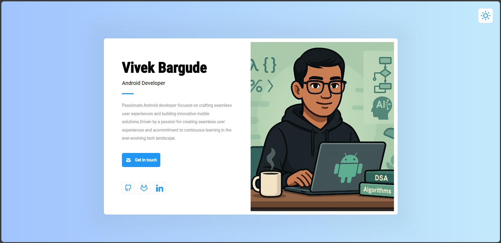
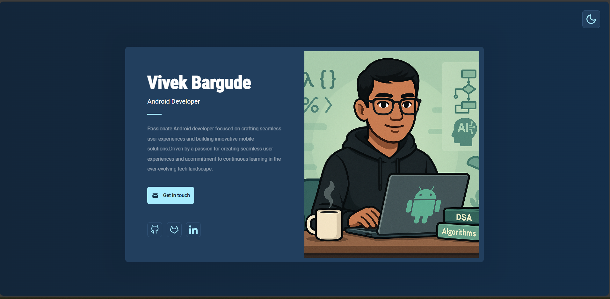

# 🌐 Simple Website with Kobweb

A minimal website project built using **Kobweb** and **JetBrains Compose for Web**, created to explore Kobweb’s component model, theming, and layout system — including light/dark mode switching and CSS utilities.

---

## 📋 Table of Contents

1. [Demo Preview](#demo-preview)  
2. [Features](#features)  
3. [Tech Stack](#tech-stack)  
4. [Project Structure](#project-structure)  
5. [Getting Started](#getting-started)  
6. [Screenshots](#screenshots)  
7. [Learn More](#learn-more)  
8. [Author](#author)  

---

## Demo Preview

### 🔆 Light Mode



### 🌙 Dark Mode



---

## Features

- 🌓 **Dark / Light Theme Toggle** with persistent storage  
- 🎨 **Dynamic Gradient Backgrounds** driven by theme  
- ⚡ **Smooth CSS Transitions** via `Modifier.transition { … }`  
- 🧩 **Composable UI** using `@Composable`, `Box`, and `Surface`  
- ✅ **Silk Theming** overrides via `@InitSilk`  
- 💾 **localStorage** integration for theme persistence  

---

## Tech Stack

- **Kobweb** – Kotlin-first web framework  
- **JetBrains Compose for Web** – Declarative UI  
- **Silk UI** – Theming & layout components  
- **Compose Web CSS DSL** – Type‑safe styling  
- **Browser APIs** – `localStorage`  

---

## Project Structure

```

simple\_website/
├── components/          # Reusable UI pieces (ProfileCard, ThemeSwitchButton)
├── pages/               # @Page-annotated screens (HomePage, etc.)
├── utils/               # Resources & constants (Res, colors, strings)
├── AppEntry.kt          # @App entrypoint & Silk theme overrides
└── index.html           # Static host HTML (generated)

````

---

## Getting Started

1. **Install Kobweb CLI**  
   ```bash
   npm install -g @varabyte/kobweb
   # or via Yarn / pnpm

2. **Create & Run Project**

   ```bash
   kobweb create simple_website
   cd simple_website
   kobweb run
   ```
3. **Open** `http://localhost:8080` in your browser.

---

## Screenshots

Place your screenshots in a `screenshots/` folder:

* `screenshots/light_mode.png`
* `screenshots/dark_mode.png`

---

## Learn More

* [Kobweb Documentation](https://kobweb.varabyte.com/)
* [Compose Multiplatform](https://github.com/JetBrains/compose-multiplatform)
* [Silk UI Guide](https://kobweb.varabyte.com/docs/ui/silk/)

---

## Author

**Vivek Bargude**
– Exploring modern Kotlin web development with Kobweb 🎉

